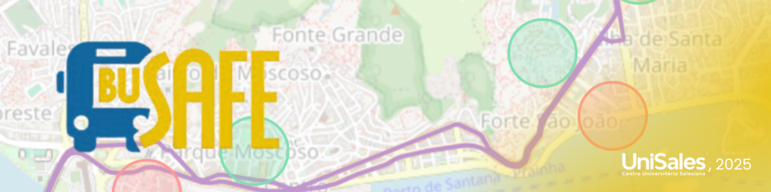
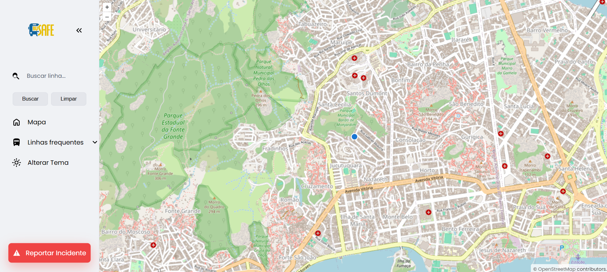
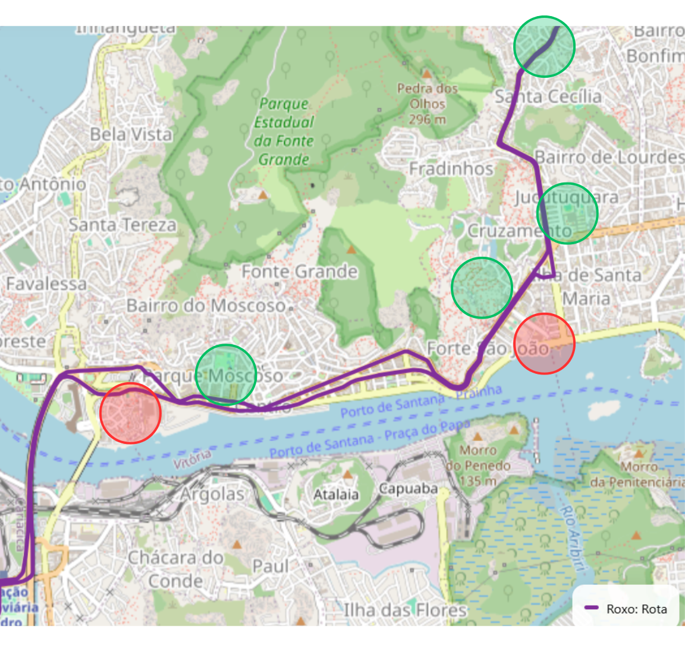

# 🚌 BuSafe - Ônibus Seguro

**BuSafe** é uma solução tecnológica desenvolvida para enfrentar a crise de confiança no transporte público do Espírito Santo. O sistema utiliza um mapa intuitivo para identificar zonas seguras e perigosas, auxiliando no planejamento de viagens mais seguras.

Este projeto foi apresentado na **XIII Mostra de Projetos Integradores de Extensão** do curso de TADS/SI/Eng. de Software do **UniSales**

---

## 📱 Funcionalidades e PWA

O sistema foi desenvolvido com um front-end responsivo, funcionando como um **Progressive Web App (PWA)**. Isso permite instalação direta no celular e uma experiência similar a um aplicativo nativo.

* **🗺️ Mapa de Risco:** Visualização de zonas com cores indicativas (Verde para segurança, Vermelho para perigo)[cite: 12, 24].
* **📍 Geolocalização e Rotas:** Exibe rotas de ônibus e a localização do usuário em tempo real, inspirada no aplicativo ÔnibusGV.
* **📢 Relato de Incidentes:** Permite reportar ocorrências (furtos, assaltos) em tempo real, detalhando tipo, linha e local.

---

## 📸 Demonstração Visual

Abaixo estão os protótipos e telas funcionais do sistema:

### 1. Mapa de Rotas e Geolocalização
Visualização ativa das rotas de ônibus utilizando a API do OpenStreetMap (OSM).

*(Figura 1: Protótipo do mapa OSM de rotas com geolocalização ativa)*

### 2. Áreas de Risco vs. Áreas Seguras
O mapa destaca visualmente as regiões baseadas no histórico de segurança.

*(Figura 2: Áreas de risco e áreas seguras demarcadas no mapa)*

### 3. Reporte de Ocorrências
Tela dedicada para o usuário inserir dados sobre incidentes ocorridos durante o trajeto.

*(Figura 3: Tela de reporte de um incidente)*

---

## 🛠️ Tecnologias Utilizadas

O desenvolvimento seguiu uma metodologia incremental com gestão via Kanban.

* **Back-end:** Java e Spring Boot.
* **Banco de Dados:** PostgreSQL.
* **Front-end:** HTML, CSS, JavaScript (Responsivo/PWA).
* **Mapas:** Integração com OpenStreetMap (OSM).
* **DevOps/Ferramentas:** Docker.

---

## 🔗 Fontes de Informação e Referências

O projeto baseou-se em dados oficiais e pesquisas de percepção pública para justificar sua relevância social. As principais fontes consultadas foram:

1.  **SESP - Secretaria de Estado da Segurança Pública e Defesa Social**
    * *Dados utilizados:* Painel de furtos e roubos e estatísticas do Observatório de Segurança Pública do Espírito Santo.
    * [Acesse o site da SESP/ES](https://observatorio.sesp.es.gov.br/crimes-contra-o-patrimonio-no-estado-do-espirito-santo)

2.  **NTU - Associação Nacional das Empresas de Transportes Urbanos**
    * *Dados utilizados:* Estudos sobre a percepção de segurança no transporte público urbano.
    * [Acesse o site da NTU](https://www.ntu.org.br/)

---

## 👥 Autores

* **Rayssa Ferreira da Silva**
* **Luiz Gabriel de Oliveira Ferreira**
* **Maria Eduarda Fernandes Almeida**
* **Victor Pimenta Jardim da Silva**

**Orientador:** Rômulo Ferreira Douro